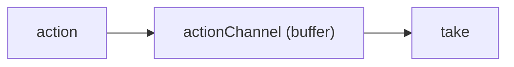

# Redux-Saga

- [Sagas](#sagas)
- [Basic Concepts](#basic-concepts)
- [Advanced Concepts](#advanced-concepts)
- [Blocking / Non-blocking](#blocking--non-blocking)

## Sagas

- A Saga is a Collection of Sub-Transactions (T1, T2, T3, ..., Tn)
- Each Sub-Transaction has a Compensating Transaction 

> Compensating Transaction (Request) must be idempotent (一直 retry 直到成功為止 )

## `takeLatest` vs `takeEvery`

`takeLatest`: Forks a `saga` (a generator funcntion) on each action dispatched to the Store that matches pattern. And automatically **cancels** any previous `saga` task started previously if it's still running.

> 除了停止前一個正在執行的 saga 外，即使 watcher 短時間內收到多個 action，還是只會啟用最後那個 saga. 
> 在處理 AJAX 請求時，我希望只能在最後一個請求的時候得到 response，takeLatest 會非常的有用。 

`takeEvery`: Spawns a `saga` on each action dispatched to the Store that matches pattern.

> 允許多個 saga task 同時被 fork

## `put` vs `putResolve`

https://codesandbox.io/s/redux-saga-example-x77jb?file=/sagas/index.js

## Terms

- Effect: An Effect is an object that **contains some information** to be interpreted by the **middleware**

---

## Basic Concepts

## Declarative Effects

- To create Effects, you use the functions provided by the library in the `redux-saga/effects` package.

```javascript
import { call } from 'redux-saga/effects'

function* fetchProducts() {
  // redux-saga middleware will take care of executing those instructions 
  // and giving back the result of their execution to the Generator.
  // call creates "a description" (a plain object) of the effect.
  const products = yield call(Api.fetch, '/products')
  // ...
}
```

## Dispatching actions to the store

---

## Advanced Concepts


## Using Channels

### Using the `actionChannel` Effect

- `actionChannel` can buffer immcoming messages if the Saga is not yet ready to take them (eg blocked on an API call)



- `take`
  - with pattern (specific action)
  - with channel 

```javascript
const {payload} = yield take('REQUEST')
const {payload} = yield take(ChannelObject)
```

The important thing to note is how we're using a blocking `call`. The Saga will remain blocked until `call(handleRequest)` returns. But meanwhile, if other `REQUEST` actions are dispatched while the Saga is still blocked, they will queued internally by `requestChan`. When the Saga resumes from `call(handleRequest)` and executes the next `yield take(requestChan)`, the `take` will resolve with the queued message.

### Using the `eventChannel` factory to connect to external events

> `eventChannel` is a factory function, not an Effect

... to be continued

## Blocking / Non-blocking

| Name | Blocking |
| ---- | -------- |
| call | Y |
| put | N |
| fork | N |
| take | Y |
| take(channel) | Sometimes (see API reference) |


## Testing Sagas

- https://github.com/jfairbank/redux-saga-test-plan

## References

1. [Applying the Saga Pattern • Caitie McCaffrey • GOTO 2015](https://youtu.be/xDuwrtwYHu8)
2. https://github.com/redux-saga/redux-saga
3. https://medium.com/%E6%89%8B%E5%AF%AB%E7%AD%86%E8%A8%98/understanding-redux-saga-148d7f070fa
